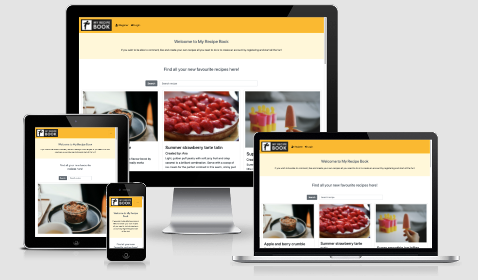

# My Recipe Book

[View the app in Heroku here](https://my-recipe-book-a.herokuapp.com/)

## Table of Contents

1. [About](#About)
2. [User Stories](#User-Stories)
3. [Features](#Features)
4. [Data Model](#Data-Model)
5. [Testing](#Testing)
6. [Technologies Used](#Technologies-Used)
7. [Deployment](#Deployment)
8. [Credits](#Credits)

## About

My Recipe Book is been designed to facilitate keeping all the cooking recipes in one place and with easy access, allowing the site user to access their personal and family recipes safe and in one place. The site also provides the opportunity to being able to discover new recipes that the site user can save.

## User Stories

#### User Site Stories

- As a Site User I can register an account so that I can comment and like a past.
- As a Site User I can view a list of posts so that I can select one to read.
- As a Site User I can view the number of likes on each post so that I can see which ones are the most viral.
- As a Site User I can click on a post so othat I can read the full text.
- As a Site User I can view a paginated list of posts so that I can easily select a post to view.
- As a Site User I can leave comments on a post so that I can be involved in the conversation. 
- As a Site User I can view comments on an individual post so that I can read the conversation.
- As a Site User I can create and save my personal recipes so that I have all my recipe in the same place.
- As a Site User I can use the "search" bar so that I can easily find recipes I am looking for.

#### Admin Site Stories

- As an admin User I can acces the admin site so that I can create and control the content I wish for my site.
- As an admin User I can create draft posts so that I can finish writing or publish the content later.
- As an admin User I can create, read, update and delete posts so that I can manage my site content.
- As an admin User I can view the number of likes on each post so that I can see which ones are the most viral.
- As an admin User I can approve/disapprove comments so that I can filter out objectionable comments.

## Features

#### Existing Features
- **Navigation Bar:** (available through all the pages on the site)
    - When not logged in or not registered, the site user can access the registration page, the login page or do a search throughout the site to find different recipes. The page goes back to the Home page when the site logo is clicked.
    - When logged in, the site user can access the logout page, the form page to create a recipe and the page where all his/her recipes are stored in "My Recipes". 

- **Footer:** (available through all the pages on the site)
    The site user can access the different social media pages the site has an account with as well as accessing the About page and go back to the Home page.

-**Home Page:**
    From here the site user can access the list of recipes created by the Site Admin. All the recipes has an image, recipe title, recipe, excerpt to know a little more about the recipe, level of difficulty, cooking time and how many likes it has. If wished the site user can click on "See Recipe" and access all the details for the recipe with all the steps and ingredients needed.

- **Login/Logout/Register:**
    The site user can register on the site and once registered s/he can log in and logout from the site whenever they want.

- **Add Recipe:**
    If registered the site user can access the form to create their own personal recipes, which are stored in the backend.

- **My Recipes:**
    The page holds all the recipes the registered site user has created as a list. From here the recipes can be seen, edited or deleted if wished by the site user. 

#### Future Features
-**My Calendar:**
    The site user will be able to save the recipes they would like to cook and specify when to orh¡ganise their weekly meals.

- **My Shopping List:**
    The site user would be able to create a shopping list based on the recipes they would like to cook during the week and specify the quantities that needs to be bought.

- **Share personal recipes:**
    The site user would be able to share their personal recipes with the rest of site users after the site admin has reviewed and authorised it.

### Wireframes
Below are the initial wireframes for the site for both desktop screens and samller devices:

**Desktop screens**

**Smaller screens**

## Data Model

## Testing

#### Bugs

#### Remaining Bugs

#### Validator Testing

- Used [PEP8online.com](http://pep8online.com/) to validate Python code
- User [W3C](https://validator.w3.org/#validate_by_input) to validate HTML and CSS code

##### Remaining erros
- setting.py
    - **line too long (for lines 119, 122, 125, 128 and 151):** lines can't be cut down to 79 characters because they contain paths and url names.
- index.html
    - 

## Technologies Used

- [Gitpod](https://gitpod.io/)
- [Github](https://github.com/)
- [Unsplash](https://unsplash.com/)
- [Lucidchart](https://www.lucidchart.com/pages/)
- [Fontawesome](https://fontawesome.com/start)
- [Cloudinary](https://cloudinary.com/)
- [Django](https://www.djangoproject.com/)
- [Heroku](https://id.heroku.com/)
- [Balsamiq]()

## Deployment

The project is been deployed to Heroku. Steps for deployment:

- Deployment to Heroku:
    - Create an account in Heroku;
    - Create a new app in Heroku: choose a unique name and region;
    - Introduce sensitive data needed to be kept secret from the config Var tab in env.py and attach the database (Cloudinary url, Database url and Secret Key);
    - Add necessary buildpacks: Python;
    - Prepare environment and settings.py file by referencing env.py and link the database variable on Heroku:
    - Migarte all the changes;
    - Get all static and media files stored in Cloudinary by adding the cloudinary url in env.py and in Heroku, add Cloudinary to settings.py as well as telling Django, link the file to the templates in Heroku and allow Heroku as a host in Allowed_Hosts;
    - In Gitpod create the media, static and templates directories;
    - Add the project name in Procfile;
    - Make deployment commit in the terminal;
    - Manually deploy content through Heroku 
    - For deployment method, GitHub was selected and confirmed we want to connect to GitHub;
    - Connect Heroku to the repository for My Recipe Blog a;
    - Set "Enable Automatic Deploys" to allow automatic deployments every time the code is pushed;
    - Click on Deploy.

## Credits

[Back to Top ⇧](#My-Recipe-Book) 